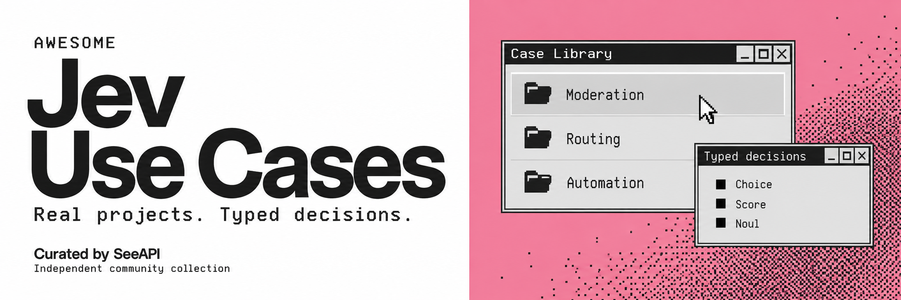
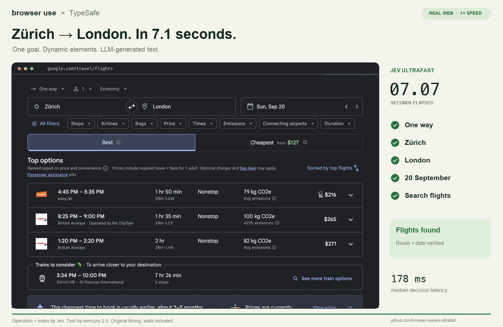
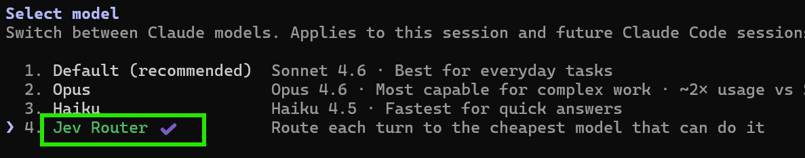
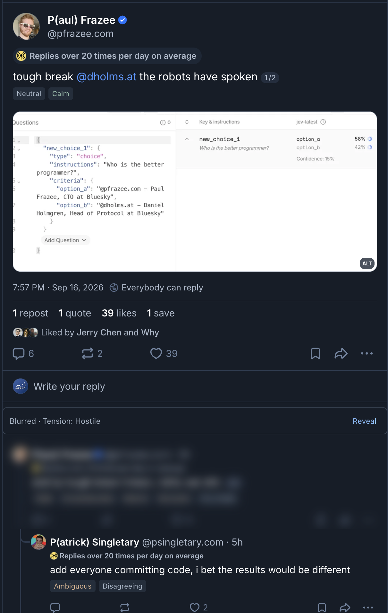
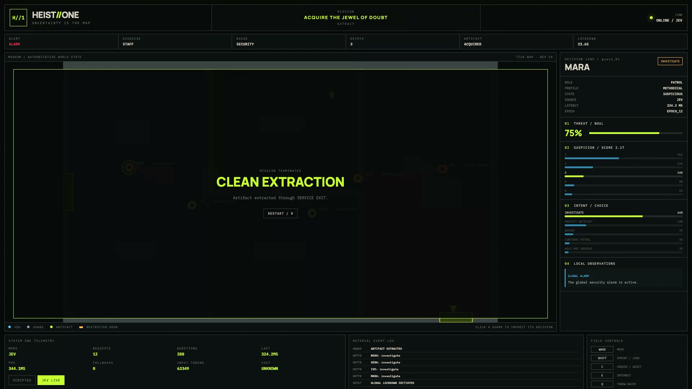
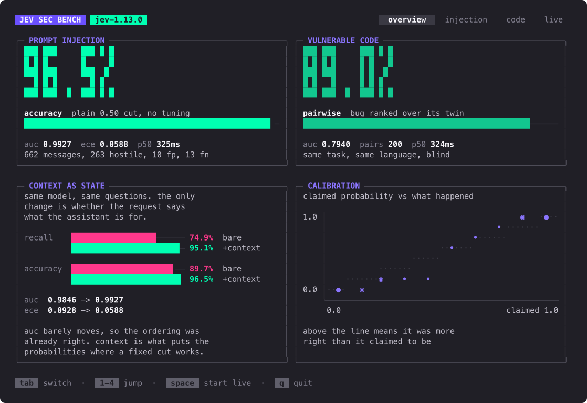
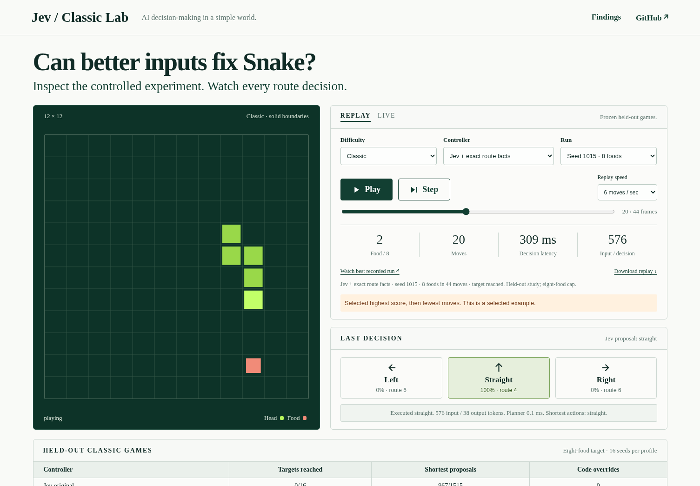

# Awesome Jev Use Cases

[](README.md) [](README_zh.md)
[](LICENSE) [](LICENSE-CODE)

Explore real projects using **[Jev](https://typesafe.ai/)** for moderation, automation, model routing, and semantic search. Each entry explains what Jev decides, how the decision fits into software, and what you can learn from the implementation.



**83 projects · Last updated: September 19, 2026**

**[Browse cases](#browse-by-use-case) · [What is Jev?](#what-is-jev) · [Integration guide](#model-origin--access-options) · [Suggest a case](CONTRIBUTING.md)**

Jev is TypeSafe AI’s System One model for structured judgments: choices, scores, and probabilities that application code uses to select the next action.

An independent community collection curated by [SeeAPI](https://github.com/SeeAPI), not an official TypeSafe project. See [review scope](#evidence--scope).

## Browse by use case

| Category | Projects | Explore |
| --- | ---: | --- |
| [Content moderation & safety](#content-moderation--safety) | 8 | Content screening, risk judgments, and moderation actions |
| [Automation & integrations](#automation--integrations) | 16 | Desktop, browser, mobile, and workflow integrations |
| [Model routing & code workflows](#model-routing--code-workflows) | 14 | Model selection, code review, and agent assignment |
| [Semantic search & graph navigation](#semantic-search--graph-navigation) | 6 | Graph navigation, semantic search, and reranking |
| [Data classification & productivity](#data-classification--productivity) | 15 | Spreadsheets, document analysis, and ticket classification |
| [Experiments & specialized applications](#experiments--specialized-applications) | 15 | Games, control systems, and specialized applications |
| [Benchmarks & behavior studies](#benchmarks--behavior-studies) | 9 | Author-reported evaluations and model behavior studies |

## Content moderation & safety

### 1. Safer with Jev — typesafe-on-neon

[Repository](https://github.com/andrelandgraf/typesafe-on-neon) · [Vision implementation](https://github.com/andrelandgraf/typesafe-on-neon/blob/main/src/lib/vision.ts) · [Jev judgments](https://github.com/andrelandgraf/typesafe-on-neon/blob/main/src/lib/judge.ts)

An HTTP gate that checks prompt injections, unsafe images, and unsafe replies before optionally forwarding a request. Its image pipeline first uses `gemini-3-flash` to describe the image, then asks Jev to judge risks in that description.

**Pattern:** detection and interpretation → typed risk judgments → allow, review, or block.

**Scope:** this is a vision-model-plus-Jev pipeline, not evidence of native image classification by Jev. The current project is a safety gate; earlier descriptions of it as a model router are outdated. We have not measured its detection accuracy.

### 2. Jev Moderation Bot

[Repository](https://github.com/brainstormity/Jev-Moderation-Bot)

A Discord moderation bot that evaluates messages and context for phishing, spam, and social engineering. Code applies escalating actions, and moderator corrections become safe precedents in later judgment context.

**Pattern:** contextual message classification → moderation action → feedback.

**Scope:** a text-message moderation project, not an image or video NSFW benchmark. False-positive performance has not been independently verified here.

### 3. jev-spam-eval

[Repository and evaluation](https://github.com/bitnovus/jev-spam-eval)

Email classification experiments comparing natural-language Jev decision criteria with TF-IDF classifiers and combined scores, including tests across different mail sources and time periods.

**Pattern:** written classification criteria → probability → threshold or ensemble.

**Scope:** exploratory author-reported experiments. The criteria were refined after inspecting labeled errors, so “no task-specific training” should not be confused with “no supervision.” We have not reproduced the results.

### 4. Jev MCP — jkudish

[Repository](https://github.com/jkudish/jev-mcp)

Exposes `jev_verify`, `jev_screen`, and `jev_find` to agents for evidence-based claim checking, input screening, and semantic candidate ranking.

**Pattern:** package narrow judgments as reusable agent tools.

**Scope:** verification depends on the supplied evidence; individual successful examples do not establish general accuracy.

### 5. Capbroker — advisory screening around capability controls

[Source](https://github.com/suryanshu-singh/capbroker) · [Implementation / documentation](https://github.com/suryanshu-singh/capbroker/blob/f7532aa83e376ad9fbc0bfbb92ada2a2a53c1999/README.md#jev-powered-defense-in-depth-advisory-only--read-this-carefully)

A capability broker optionally uses Jev to flag suspicious MCP tool output and show risk advice at a human-approval prompt. Deterministic capability checks and the human approval decision remain separate from the model advice.

**Pattern:** Capability enforcement → optional content warning or risk advice → human decision where required.

**Scope:** The Jev layer is advisory and does not make the broker’s permission decision. The author’s attack demos use a fake upstream and test credentials. Missing warnings do not establish safety, and permitted operations can still be misused. Not executed here.

**Reviewed:** 2026-09-18.

### 6. Openroom — editable chat-moderation rules

[Source](https://openroom-ivory.vercel.app) · [Implementation / documentation](https://x.com/stoufax/status/2100899469843673218)

The author describes a chat application using Jev, Convex, and Vercel to review messages before display. Natural-language room rules can be edited to trigger re-evaluation, with uncertain messages held for human review.

**Pattern:** Message and room rules → moderation judgment → display or human-review queue.

**Scope:** This entry is based on the author’s public description, not a verified backend implementation. No messages were submitted or rules saved during this review; thresholds and moderation accuracy remain unverified.

**Reviewed:** 2026-09-18.

### 7. JEVScan — Etherscan risk indicators

[Source](https://x.com/theRaz0r/status/2100898307186864593)

The author presents a Chrome extension that uses Jev to flag potentially malicious addresses and transactions on Etherscan. The collection records it as an author-demonstrated risk-indicator interface.

**Pattern:** Blockchain-explorer context → risk judgment → on-page indicator for human inspection.

**Scope:** The author’s post establishes the claimed integration, not its accuracy. Public implementation, input features, thresholds, and request traces were not verified. A risk label is not proof of fraud, and no extension or model call was run here.

**Reviewed:** 2026-09-18.

### 8. BlueNoise — X reply noise filtering

[Project](https://github.com/rokcso/bluenoise) · [Discovery source](https://github.com/logicrw/awesome-jev-projects/issues/3)

A browser extension combines local keyword and account rules with an optional Jev noise assessment for replies that local rules do not match. Code uses the judgment to filter replies on X.

**Pattern:** Local rules → remaining reply text and context → noise probability → display policy.

**Scope:** The Jev option is experimental and disabled by default. Enabling it sends reply text to TypeSafe; the default local-only behavior does not describe that mode. Filtering quality was not independently tested.

**Reviewed:** 2026-09-19 (author documentation; no execution).

**Demo material:** [Author screenshots and feature description](https://x.com/rokcso/status/2100876608340910548). Original author material, linked only; not SeeAPI test results.

## Automation & integrations

<a id="5-jev-ultrafast"></a>

### 9. Jev Ultrafast

[Repository and measurement notes](https://github.com/browser-use/jev-ultrafast)

A browser agent that turns visible controls into indexed candidates. Jev chooses an operation and target; a separate language model writes text when needed.

**Pattern:** observed state → bounded action selection → execution → observation.

**Scope:** the reported roughly 7.1-second flight search is a specific author-measured run, timed after the initial page observation. It is not a general browser-task speed guarantee.

**Demo material**: [Original flight-search demo](https://github.com/browser-use/jev-ultrafast/blob/main/docs/demo.mp4)



Original author material: Flight-search result. Measurements shown are author-reported, not SeeAPI tests. MIT · [Source](https://github.com/browser-use/jev-ultrafast/blob/452c1ad2dd628008f1d5608f28158d76e49e6cc0/docs/flights-result.png) · [License and attribution](THIRD_PARTY_NOTICES.md)

<a id="6-jev-desktop-control-in-agent-desktop"></a>

### 10. Jev desktop control in agent-desktop

[Repository](https://github.com/lahfir/agent-desktop) · [Jev loop](https://github.com/lahfir/agent-desktop/blob/main/scripts/jev/run.mjs)

A Jev integration reads an operating-system accessibility tree, selects an operation and target, and hands the result to a local desktop executor.

**Pattern:** separate interface observation, model decisions, and execution.

**Scope:** agent-desktop is a broader desktop tool with a specific Jev integration, not an exclusively Jev-based project.

**Demo material**: [Original desktop demonstration](https://github.com/user-attachments/assets/9b2c9f8c-a49d-4b69-b6cf-11d9e0d40ceb)

<a id="7-typesafe-mcp--itsmostafa"></a>

### 11. Typesafe MCP — itsmostafa

[Repository](https://github.com/itsmostafa/typesafe-mcp)

An MCP server connecting Claude Code, Claude Desktop, and Codex to Jev. Its `evaluate` tool accepts state and Noul, Choice, or Score questions for tasks such as ticket triage.

**Pattern:** ask several independent typed questions about the same state.

**Scope:** an integration tool; configurable examples should not all be counted as deployed customer use cases.

<a id="8-semdecide"></a>

### 12. SemDecide

[Repository](https://github.com/sharziki/semdecide)

Brings semantic predicates, routing, scoring, filtering, and guard decisions into Unix pipelines and CI through `is`, `choose`, `score`, `filter`, and `guard` commands.

**Pattern:** typed judgments with explicit thresholds, uncertainty, and process exit codes.

**Scope:** semantic judgments do not replace authorization or execution controls.

<a id="9-typesafe-computer-use"></a>

### 13. typesafe-computer-use

[Project](https://github.com/awlevin/typesafe-computer-use) · [Discovery post](https://x.com/studio_yebisu/status/2100686990090047569)

A Mac automation loop converts screen information through OCR and deterministic processing, asks Jev to choose an action, and uses a writing model only when free text is needed.

**Pattern:** Screen interpretation → bounded action selection → desktop execution.

**Scope:** OCR and local processing provide perception; Jev does not directly inspect screenshots. Author timing comparisons include task-specific preprocessing and have not been reproduced here.

<a id="10-jev-browser"></a>

### 14. Jev Browser

[Project](https://github.com/vlad-terin/jev-browser) · [Discovery post](https://x.com/studio_yebisu/status/2100686990090047569)

An agent skill and runtime that uses existing browser tools in a continuous observation, action, and verification loop. The planning agent supplies the goal and navigation guidance; Jev selects observed elements.

**Pattern:** Plan once, then execute repeated bounded browser decisions.

**Scope:** An unofficial integration requiring compatible browser tools; it is distinct from browser-use/jev-ultrafast and is not a browser service by itself.

**Demo material**: [Original browser demo](https://github.com/user-attachments/assets/2e456743-96d5-4ad9-8ca3-97f7b6ed11f2)

<a id="11-mobile-jev"></a>

### 15. Mobile Jev

[Project](https://github.com/droidrun/mobile-jev) · [Discovery post](https://x.com/studio_yebisu/status/2100686990090047569)

A mobile agent uses Jev to select actions on a real Android device through Mobilerun, with a studio, CLI, and execution traces.

**Pattern:** Goal → mobile state → action selection → device execution.

**Scope:** The documented Uber demo reaches payment selection, not a completed booking. The reported 21 seconds for nine actions is one recorded task, not a general latency guarantee.

**Demo material**: [Android demo: Uber route to payment selection](https://github.com/droidrun/mobile-jev/blob/main/docs/media/uber-demo.mp4)


Original author material: Android Uber demonstration. Measurements shown are author-reported, not SeeAPI tests. MIT · [Source](https://github.com/droidrun/mobile-jev/blob/395fc222beac4f059f9a0beb337d114a2b066e99/docs/media/uber-demo.jpg) · [License and attribution](THIRD_PARTY_NOTICES.md)

<a id="12-zod-jev--semantic-validation"></a>

### 16. zod-jev — semantic validation

[Project](https://github.com/jomatsu/zod-jev)

Adds Jev semantic checks to Zod schemas, turning probabilities into validation issues alongside ordinary shape checks.

**Scope:** Uncertain and unavailable judgments need explicit handling; a passing check does not establish factual correctness.

<a id="13-ha-jev--home-assistant-decisions"></a>

### 17. HA-Jev — Home Assistant decisions

[Project](https://github.com/AboveColin/HA-Jev)

Turns home entity states into Jev probabilities, choices and scores exposed as sensors or automation responses.

**Scope:** Device-state quality and automation policies determine whether a judgment is useful; integration was not run here.

<a id="14-n8n-typesafe-community-node"></a>

### 18. n8n TypeSafe community node

[Project](https://github.com/DomMonte/n8n-nodes-typesafe-ai)

Exposes typed TypeSafe questions inside n8n so downstream workflow nodes can branch on answers.

**Scope:** A community integration; installation eligibility and retry handling depend on the n8n environment and workflow.

<a id="15-unclutter--page-clutter-filtering"></a>

### 19. Unclutter — page clutter filtering

[Project](https://github.com/kitze/unclutter)

A browser extension classifies page elements with Jev and hides selected clutter using reusable rules.

**Scope:** Uncertain elements should remain; hiding a consent dialog does not make a consent choice for the user.

<a id="16-jev-mobile--android-settings-poc"></a>

### 20. jev-mobile — Android Settings PoC

[Project](https://github.com/Friedjof/jev-mobile)

Uses semantic UI state, stability checks and bounded action choices for an Android observe–decide–act loop.

**Scope:** The author exercised Android Settings; this is distinct from droidrun/mobile-jev and is not a general mobile agent.

### 21. triage-guard — support, alert, and deployment judgments

[Source](https://github.com/shivam2003-dev/typesafe-triage-guard) · [Implementation / documentation](https://github.com/shivam2003-dev/typesafe-triage-guard/blob/9dea2e2c82eb0acb8b9bac8e366ad9112fa770fd/src/triage/battery.py)

A Python worked example shares a judgment engine across support tickets, operational alerts, and deployment risk. Batched Noul risk signals and a severity Score feed code-owned policy tables; the ticket flow adds department and urgency judgments.

**Pattern:** Input → risk battery → policy thresholds → pass, review, block, or support route.

**Scope:** The author labels it R&D. Its keyword-based offline mock tests composition rather than Jev quality; mock results must not be presented as model results. Thresholds and real deployment outcomes were not validated here.

**Reviewed:** 2026-09-18.

### 22. typesafe-jev-workflow — LangGraph email routing

[Source](https://github.com/GiesN/typesafe-jev-workflow) · [Implementation / documentation](https://github.com/GiesN/typesafe-jev-workflow/blob/251019670ebc3bf95870e924740d5876c1cd56b5/src/typesafe_ai_langgraph/typesafe_ai_langgraph_workflow.py)

An asynchronous LangGraph example sends email sender, subject, and body to a Choice question for invoice or general intent. Handlers set accounts_payable or general_inbox in graph state.

**Pattern:** Mock email → Jev intent classification → graph branch and destination label.

**Scope:** Handlers do not send email or make payments. Ten labeled mock emails are a smoke check, not an accuracy benchmark. The graph records confidence but has no low-confidence routing threshold; this collection did not execute it.

**Reviewed:** 2026-09-18.

### 23. Pi Jev Auto Mode — tool-call probability gate

[Source](https://github.com/jomatsu/pi-jev-auto-mode) · [Implementation / documentation](https://github.com/jomatsu/pi-jev-auto-mode/blob/main/src/settings.ts)

A Pi extension combines deterministic command rules with Jev judgments before bash, write, and edit calls. Code compares condition probabilities with thresholds to produce allow, deny, or uncertain decisions.

**Pattern:** Tool call → deterministic checks → semantic conditions → local execution gate.

**Scope:** At review, README describes blocking uncertain results, while src/settings.ts sets uncertain to allow; src/jev/decide.ts treats an uncertain hazard-mode condition as satisfied. Check the actual version and policy rather than assuming fail-closed behavior. No safety guarantee or runtime validation is established here.

**Reviewed:** 2026-09-18.

### 24. jev-skip — caption-based sponsor detection

[Repository](https://github.com/valentynkit/jev-skip)

A browser extension sends YouTube captions to Jev for sponsor-probability judgments on time segments. Local code displays a seek-bar heatmap and can skip selected segments without relying on a crowdsourced timestamp database.

**Pattern:** Caption text → segment judgments → seek-bar overlay and optional skipping.

**Scope:** No captions means no analysis; this is text classification, not audio or video understanding. The author reports 77% coverage of SponsorBlock-labeled sponsor seconds across 23 videos, with 34 seconds of false skips per hour and $0.0008 per video. These gateway-based measurements were not independently reproduced. The demo replays recorded answers; Jev API calls are still required for new judgments.

**Reviewed:** 2026-09-19 (author documentation; no execution).

## Model routing & code workflows

<a id="17-jev-codex-router"></a>

### 25. Jev Codex Router

[Repository and backtest](https://github.com/0xNatoshi/jev-codex-router)

Classifies coding turns with Jev and applies a policy to select a model and reasoning depth, with logging and fallback behavior.

**Pattern:** task classification → model selection → quality and cost evaluation.

**Scope:** the reported roughly 60% savings comes from the author's replay of 237 real turns. It is not a SeeAPI measurement or a guaranteed saving.

<a id="18-winnow"></a>

### 26. Winnow

[Repository](https://github.com/GhalebDweikat/winnow)

Judges blocks of long Claude Code tool outputs for task relevance. Confidently irrelevant blocks become summaries or stubs, while full text remains recoverable; uncertain blocks are retained.

**Pattern:** reversible relevance filtering before context ingestion.

**Scope:** judgment and summary generation are separate stages. Results using an alternative judge adapter should not be attributed to Jev.

<a id="19-jev-review"></a>

### 27. Jev Review

[Repository](https://github.com/devagrawal09/jev-review)

Reviews diffs or codebases through staged judgments about risk, file profiles, evidence, mechanisms, severity, and conditional reviewer routing.

**Pattern:** compose small judgments to focus deeper review on concrete regions.

**Scope:** an experiment that currently does not integrate compiler diagnostics or static analyzers. Findings are review leads, not proof of defects.


Original material: Dev Agrawal · MIT · Unmodified · [Source](https://github.com/devagrawal09/jev-review/blob/31f89602797fb7bea007f8a480bf368bf564954e/docs/dashboard.png) · [License and attribution](THIRD_PARTY_NOTICES.md)

<a id="20-jev-router--gargpratyush"></a>

### 28. jev-router — gargpratyush

[Project](https://github.com/gargpratyush/jev-router) · [Discovery post](https://x.com/studio_yebisu/status/2100686990090047569)

Routes fresh user turns in Claude Code and Codex to fast or strong model tiers while launching the original CLIs.

**Pattern:** Classify a turn and select a model without replacing the CLI.

**Scope:** A separate project from Jev Codex Router by 0xNatoshi. Its README describes per-user-turn routing, not a fresh model choice for every internal tool step.



Original author material: Model selection interface. Measurements shown are author-reported, not SeeAPI tests. MIT · [Source](https://github.com/gargpratyush/jev-router/blob/86660a0248eba0e4523f81645ac2925e9808c000/docs/model-picker.png) · [License and attribution](THIRD_PARTY_NOTICES.md)

<a id="21-eve--typed-evaluation-and-model-selection"></a>

### 29. eve — typed evaluation and model selection

[Project](https://github.com/vercel/eve) · [Discovery post](https://x.com/yibie/status/2100619188062523695) · [Implementation / 文档](https://github.com/vercel/eve/blob/main/docs/guides/evaluate.md)

The agent framework uses Jev by default for automatic model selection and typed evaluations; its documented tool-approval integration can escalate uncertain or failed reviews to a human.

**Pattern:** Embed typed evaluation in model routing, tools, and approval decisions.

**Scope:** Jev is the evaluator, not the sole model powering eve. The underlying AI SDK evaluation specification is experimental.

<a id="22-dspy-typesafeify--hybrid-inference"></a>

### 30. DSPy typesafeify — hybrid inference

[Project](https://github.com/typesafeainate/dspy-typesafeify)

A proof-of-concept decorator routes boolean, enum and configured score fields to Jev while a generative model handles free text.

**Scope:** The author's comparison uses three examples; it does not establish general cost or speed improvements.

**Demo material**: [Author three-example comparison chart](https://github.com/typesafeainate/dspy-typesafeify/blob/708f1d109fc9316bdbb5674bdb10cf18b55be137/examples/typesafe_dspy_ticket_triage/benchmark.svg)

<a id="23-jevlogs--log-triage"></a>

### 31. jevlogs — log triage

[Project](https://github.com/reachjalil/jevlogs)

Scores diagnostic value and priority of OpenTelemetry logs before expensive analysis, while retaining an archive.

**Scope:** Annotation alone does not skip downstream analysis; savings depend on forwarding mode and policy.

<a id="24-swarmrouter--agent-assignment"></a>

### 32. SwarmRouter — agent assignment

[Project](https://github.com/ndolinschi/swarmrouter) · [Implementation](https://github.com/ndolinschi/swarmrouter/blob/37a895b82633fc1964577c89dfee8b87f6914cc2/src/lib/product.ts)

Selects a specialist agent and judges ambiguity or the need for collaboration using typed questions.

**Scope:** Routing recommendations do not demonstrate an executed multi-agent workflow; keyless demo responses are local heuristics.

<a id="25-jev-axi--judgment-cli-for-agents"></a>

### 33. jev-axi — judgment CLI for agents

[Project](https://github.com/shiftynick/jev-axi)

Provides typed commands for guard checks, build-log triage, diff review and bulk filtering, with reusable question recipes.

**Scope:** The author's agent experiment reduced file reads without reducing cost; judgments do not replace source inspection or a complete safety boundary.

### 34. Pi Warden — coding-agent rule feedback

[Source](https://github.com/DevMortimer/pi-warden) · [Implementation / documentation](https://github.com/DevMortimer/pi-warden/blob/main/README.md)

A Pi extension checks edits against project rules and places feedback in the agent’s context. Other guards assess task drift, unsupported completion claims, and risky actions; deterministic patterns and model judgments feed code-owned responses.

**Pattern:** Agent context and proposed changes → rule/risk checks → feedback or selected holds.

**Scope:** Many findings steer or warn rather than block. The author’s 150 paired runs report fewer rule violations, but other measured axes showed little or no improvement; results are not independently reproduced. The extension is not a sandbox or complete permission boundary.

**Reviewed:** 2026-09-18.

### 35. commit-miner — commit classification and security-fix signals

[Source](https://github.com/devanshbatham/commit-miner) · [Implementation / documentation](https://github.com/devanshbatham/commit-miner/blob/977617ebce07c56b965253a68577b1d92b93fdf1/src/miner.rs)

A Rust CLI asks Noul questions about Git changes to identify bug-fix, security-fix, change-type, and CWE signals. Large inputs are reviewed in sections before selected evidence is used for a final judgment; local thresholds assign labels.

**Pattern:** Commit diff → section judgments → selected evidence review → thresholded labels.

**Scope:** Labels are model signals, not confirmed vulnerabilities. File policies exclude some content, and final reviews of long diffs use selected evidence rather than all changes. Source diffs and metadata are sent to TypeSafe; incomplete scans retain completed results. No scans were executed here.

**Reviewed:** 2026-09-18.

### 36. Foreman — semantic supervision of coding processes

[Source](https://github.com/thruwire/foreman) · [Implementation / documentation](https://github.com/thruwire/foreman/blob/2c439828b9fe45ee5d40f6f57be81f7ff1f8a140/src/foreman/runtime.py)

An experimental runtime sends bounded task, worker-output, diff, and verification observations to nine Noul questions in one request. A deterministic policy uses those assessments to continue, start, stop, retry, verify, finish, or escalate managed work; assessments are printed for the CLI user.

**Pattern:** Bounded worker observations → semantic assessment → local policy → process lifecycle action.

**Scope:** At the linked commit, the worker interface exposes run and terminate, not a text-steering channel into a running agent. Scores are uncalibrated for this use case; incorrect judgments can stop useful work or accept bad work. Static inspection only: no Foreman, Codex, or Jev execution was performed.

**Reviewed:** 2026-09-18.

### 37. jev-belay — completion checks for Claude Code

[Repository](https://github.com/valentynkit/jev-belay)

A Claude Code Stop hook inspects the current turn’s transcript for file changes and verification evidence. When changes lack a subsequent passing check, it asks Jev four questions about the closing message; local thresholds and repetition limits determine whether to allow the stop or return feedback.

**Pattern:** Local transcript evidence → conditional Jev judgment → allow stop or request follow-up.

**Scope:** Errors fail open. Turns without detected edits, subagent work in separate transcripts, and unrecognized verification commands can escape the gate. Detection accuracy has not been established by this collection; the published demo uses fake model answers. It is a completion-feedback tool, not proof that work is correct.

**Reviewed:** 2026-09-19 (author documentation; no execution).

### 38. jev-commit — commit-message and diff checks

[Repository](https://github.com/valentynkit/jev-commit)

A commit-msg hook, installable through the pre-commit framework, sends the staged diff and commit message to Jev for judgments about message quality, consistency, debug leftovers, unmentioned work, and credential-like content. Code applies thresholds and a separate credential check.

**Pattern:** Staged diff and message → typed judgments and credential checks → local warning or blocking policy.

**Scope:** By default, non-secret findings warn while likely credentials can block; strict mode also blocks other findings. Large diffs may require multiple requests. Staged source and messages are submitted to the configured API endpoint; this is not a complete secret-detection boundary. Detection accuracy was not independently validated.

**Reviewed:** 2026-09-19 (author documentation; no execution).

## Semantic search & graph navigation

<a id="26-blink"></a>

### 39. Blink

[Repository](https://github.com/ellipsis-dev/blink)

Finds files from natural-language queries by having Jev score file and folder names, allocating walkers along likely paths.

**Pattern:** narrow a search space through repeated semantic choices.

**Scope:** result percentages represent the share of walkers reaching a file, not file correctness probabilities. This is not a full source-code semantic index.

<a id="27-neo4jev"></a>

### 40. neo4jev

[Repository](https://github.com/jexp/neo4jev)

Navigates a Neo4j graph by presenting outgoing relationships as Choice options, asking a Noul goal-completion question, and exploring candidate paths with beam search.

**Pattern:** model-guided edge selection inside a deterministic search algorithm.

**Scope:** a demo with explicitly labeled stand-in answers when real TypeSafe calls fail. A running demo alone does not prove that every answer came from Jev.

<a id="28-sift--search-result-reranking"></a>

### 41. Sift — search result reranking

[Project](https://github.com/tylergibbs1/sift)

A Chrome extension asks Jev about relevance, promotional content and depth, then reranks Google results in code.

**Scope:** Judgments use result snippets rather than full pages; search intent affects filtering.

<a id="29-every--function-level-semantic-search"></a>

### 42. Every — function-level semantic search

[Project](https://github.com/sufianetaouil/every)

Parses source into functions and asks Jev a yes/no question for each, returning ranked matches with cached scores.

**Scope:** Function-local judgments do not establish whole-program dataflow; scanned source is sent to TypeSafe.

### 43. Jev Search — intent selection and result reranking

[Source](https://github.com/superagents-lab/jev-search) · [Implementation / documentation](https://github.com/superagents-lab/jev-search/blob/369b282489f72e58298ba1abc8b0144b1bc15c59/src/lib/typesafe.ts)

A TypeScript application asks Jev to select search sources, time ranges, and query candidates, fetches results through Search1API, then judges title/snippet relevance in batches. Code merges URLs and ranks results by relevance, engine agreement, and original position.

**Pattern:** Search intent → external retrieval → per-result judgments → merged, streamed rankings.

**Scope:** Relevance scores do not verify page facts; snippets can be incomplete or stale. A search can make several provider calls. Source and ranking code were inspected, but retrieval quality, latency, and cost were not measured.

**Reviewed:** 2026-09-18.

### 44. jev.nvim — semantic function search in Neovim

[Repository](https://github.com/valentynkit/jev.nvim)

A Neovim plugin uses Treesitter to split buffer code into functions and asks Jev whether each function matches a natural-language question. Results appear as probabilities in virtual text and a ranked quickfix list, integrating semantic search into the editor.

**Pattern:** Buffer or selected files → function extraction → per-function judgments → ranked editor results.

**Scope:** Functions are judged separately, without cross-function context; matches are search leads rather than confirmed defects. Source snippets are sent to the configured API endpoint. The published demo uses fixture probabilities, not measured model results. Ranking quality was not independently evaluated.

**Reviewed:** 2026-09-19 (author documentation; no execution).

## Data classification & productivity

<a id="30-judge-sheets--predictive-spreadsheets"></a>

### 45. Judge Sheets — predictive spreadsheets

[Project](https://github.com/dabit3/jev-experiments/tree/main/judge-sheets) · [Discovery post](https://x.com/dabit3/status/2100780008193020049)

Typing a column header such as Urgency lets Jev infer a prediction schema; confirming it fills rows through JUDGE, PICK, and RATE functions, with grouped requests and streamed updates.

**Pattern:** Header intent → typed schema → row judgments → spreadsheet recalculation.

**Scope:** A standalone spreadsheet demo, not a Google Sheets integration. Roughly 100 ms refers to individual judgments or header interpretation, not the entire column. Timings are author-reported; mock mode is also available.

**Demo material**: [Original screenshot and animated demo](https://github.com/dabit3/jev-experiments/tree/main/judge-sheets#judge-sheets--predictive-spreadsheets)

<a id="31-notra--typed-evaluation-in-analytics"></a>

### 46. Notra — typed evaluation in analytics

[Project](https://github.com/usenotra/notra) · [Discovery post](https://x.com/yibie/status/2100619188062523695) · [Implementation / 文档](https://github.com/usenotra/notra/blob/main/packages/ai/src/evaluation/client.ts)

The codebase includes a Jev evaluation client through Vercel AI Gateway, a NOTRA_JEV_CLASSIFIERS flag, and optional typed evaluation alongside brand-mention analysis.

**Pattern:** Introduce typed judgments into an existing analytics workflow with an LLM fallback.

**Scope:** Source inspection establishes an integration path, not independently verified production deployment or latency. Existing LLM judgment still supplies competitor information and excerpts in the inspected workflow.

<a id="32-human-compiler--writing-diagnostics"></a>

### 47. human-compiler — writing diagnostics

[Project](https://github.com/asfarsadewa/human-compiler)

Combines local text analysis with Jev questions about clarity, intent and tone; deterministic rules render diagnostics.

**Scope:** Diagnostics reflect chosen rubrics and thresholds, not objective writing quality or generated explanations.

<a id="33-kill-my-idea--idea-scoring"></a>

### 48. Kill My Idea — idea scoring

[Project](https://github.com/monteduro/killmyidea)

Jev scores a product idea against several criteria; local weighting maps the results to a product verdict.

**Scope:** Heuristic feedback, not validated prediction of business success; the project also supports mock data.

<a id="34-jev-cv-screening"></a>

### 49. Jev CV Screening

[Project](https://github.com/gtaras7/typesafe-jev/tree/main/cv-screen)

Stores typed CV judgments separately from local scoring rules, allowing supported policy changes to reuse existing answers.

**Scope:** New questions require new judgments. The example policy includes age and military-service criteria; it is not an endorsed hiring policy or validated fairness assessment.

<a id="35-jevibe-check--social-tone-labels"></a>

### 50. Jevibe Check — social tone labels

[Project](https://github.com/sriganesh/jevibe-check)

Labels Bluesky posts and drafts using Jev choices, with custom classifiers and filtering controls.

**Scope:** Text-only analysis excludes images, videos and wider conversation context; sarcasm can be misclassified.



Original author material: Tone labels and post filtering. Measurements shown are author-reported, not SeeAPI tests. MIT · [Source](https://github.com/sriganesh/jevibe-check/blob/8c6ab8837265b762699dc6b4a130f9a9a369fd89/docs/screenshots/post-filter.png) · [License and attribution](THIRD_PARTY_NOTICES.md)

**Demo material**: [Animated demo](https://github.com/sriganesh/jevibe-check/blob/8c6ab8837265b762699dc6b4a130f9a9a369fd89/docs/jevibecheck.gif)

<a id="36-jev-resume-analyzer"></a>

### 51. JEV Resume Analyzer

[Project](https://github.com/awun8191/jev-resume-analyzer)

Reviews extracted CV text against explicit rubrics and optional job requirements, showing questions and answer distributions.

**Scope:** Missing, inapplicable and unassessable evidence remain distinct; it does not provide a validated hiring prediction or ATS score.

<a id="37-lanebreak--support-ticket-routing"></a>

### 52. LaneBreak — support ticket routing

[Project](https://github.com/ndolinschi/lanebreak) · [Implementation](https://github.com/ndolinschi/lanebreak/blob/acf11293f36597c8fb706ae492a9468455b69928/src/lib/product.ts)

Uses Choice for team assignment, Score for priority, and Noul for refund intent, churn signals and human escalation.

**Scope:** Without an API key the implementation uses local heuristic demo responses; those are not Jev results.

<a id="38-jev-column-race--review-annotation"></a>

### 53. Jev Column Race — review annotation

[Project](https://github.com/goodrahstar/jev-column-race)

Batches sentiment, topic, bug and churn judgments over app reviews, then allows local reranking; includes a comparison with Gemini.

**Scope:** The published timing is from a recorded run pair. Agreement between models or with star ratings is not ground-truth accuracy.


Original author material: Author-recorded comparison. Measurements shown are author-reported, not SeeAPI tests. MIT · [Source](https://github.com/goodrahstar/jev-column-race/blob/d9ee360ccd84462f4eab9493a7c2c617d0dab9df/docs/verdict.png) · [License and attribution](THIRD_PARTY_NOTICES.md)

### 54. JevTicketRouter — bilingual support triage

[Source](https://github.com/GhrezaKh74/JevTicktRouter) · [Implementation / documentation](https://github.com/GhrezaKh74/JevTicktRouter/blob/ee078fcddd85d339b182fb5ba3cce5ae1021d447/backend/JevTicketRouter.Application/Jev/JevTriageQuestions.cs)

A .NET and React application classifies Persian or English support tickets. One request asks Choice questions for category and team, a Score for priority, and Noul questions for sensitive data and human review; local rules handle escalation and redaction.

**Pattern:** Ticket → five typed judgments → local review and redaction rules.

**Scope:** The no-key demo can use deterministic mock answers. Low confidence forces human review rather than correcting category, team, or priority. Routing accuracy and redaction coverage were not tested.

**Reviewed:** 2026-09-18.

### 55. Transcript Scorecard — incremental call evaluation

[Source](https://github.com/brandonbryant12/transcript-scorecard) · [Implementation / documentation](https://github.com/brandonbryant12/transcript-scorecard/blob/c9232fffbf8bf23b7cf5402dd02ebc54b19eb9cf/apps/api/src/classifier.ts)

A proof of concept replays fictional support-call transcripts incrementally. Each enabled criterion contributes a Score and a Choice selecting an evidence sentence; code normalizes and weights the results, then stores the final evaluation in SQLite.

**Pattern:** Growing transcript → criterion scores and evidence selection → weighted score history.

**Scope:** This is transcript replay, not verified live audio recognition. Evaluations send the current transcript prefix to TypeSafe; costs can grow with the conversation. The documented local demo has no authentication. Scoring quality and timing were not reproduced.

**Reviewed:** 2026-09-18.

### 56. Paper Trellis Citation Verifier — citation support review

[Source](https://github.com/MarissaFamularo/citation-verifier) · [Implementation / documentation](https://github.com/MarissaFamularo/citation-verifier/blob/f9058642274033e62855d3066988418fefa2e272/src/lib/typesafe.js)

A manuscript-review tool pairs citing sentences with source passages. Claude can locate quotations, code checks quotation presence, and Jev chooses supports, contradicts, or says_nothing for the sentence and selected passage; the reviewer retains the final decision.

**Pattern:** Citation matching → passage selection → three-way support judgment → human review.

**Scope:** Jev reads a bounded passage around a quotation, or the source opening, rather than the entire paper. Passage-selection errors and abstract-only access limit the evidence. The author says thresholds lack biomedical validation; no manuscripts or model calls were tested here.

**Reviewed:** 2026-09-18.

### 57. Research Desk — staged news and company judgments

[Source](https://github.com/0xnairb/research_desk) · [Implementation / documentation](https://github.com/0xnairb/research_desk/blob/main/app/README.md)

A demonstration uses company profiles and headlines from yfinance in a staged Jev pipeline for relevance filtering, ranking, and mechanism matching. A request view exposes the state and typed questions behind the displayed judgments.

**Pattern:** Company/news inputs → staged judgments → code-based filtering and traceable results.

**Scope:** The author describes thresholds as initial guesses rather than values fitted to outcomes. Request visibility is not evidence of forecast accuracy or investment returns. No trading effectiveness, reported cost, or timing was independently tested.

**Reviewed:** 2026-09-18.

### 58. JevFilterForX — timeline value scoring

[Project](https://github.com/grayrepo-byte/jev_filter_for_x) · [Discovery source](https://x.com/0xLogicrw/status/2100861912590205411)

An X extension asks Jev to score signal, actionability, and originality. Local weighting produces a 0–100 value score, while topic and noise labels support filtering and focus modes.

**Pattern:** Post text → rubric scores and labels → weighted score → timeline filtering.

**Scope:** This is timeline scoring, distinct from BlueNoise’s reply filtering and Jevibe Check’s Bluesky labels. Without an API key it uses mock results. Collapsing attached media does not establish that Jev understands images or video; scoring quality was not tested.

**Reviewed:** 2026-09-19 (author documentation; no execution).

**Demo material:** [Author demo video](https://github.com/grayrepo-byte/jev_filter_for_x/blob/main/assets/promo/jevfilterforx-promo.mp4) · [Poster](https://github.com/grayrepo-byte/jev_filter_for_x/blob/main/assets/promo/jevfilterforx-promo-poster.png). Original author material, linked only; not SeeAPI test results.

### 59. JevScout — career-page navigation and job matching

[Project](https://github.com/hqman/JevScout) · [Discovery source](https://x.com/0xLogicrw/status/2100861912590205411)

A coding-agent skill starts from a company website, uses Chrome through CDP to observe and navigate pages, and asks Jev to judge links and rank jobs against a job-seeker profile.

**Pattern:** Company website → career-link judgments → job discovery → profile-based ranking.

**Scope:** A demo MVP with mock and fixture-based workflows. Those demonstrations must not be presented as real Jev results. This is job-seeker assistance, distinct from employer-side CV screening; matching quality and end-to-end reliability were not tested.

**Reviewed:** 2026-09-19 (author documentation; no execution).

## Experiments & specialized applications

<a id="39-typesafe-ai-playground"></a>

### 60. TypeSafe AI Playground

[Repository](https://github.com/markjaquith/typesafe-ai-playground)

A Rust CLI exploring tasks such as protected health information detection and code-comment review through typed questions and scores.

**Pattern:** reuse decision primitives across clearly defined application criteria.

**Scope:** experimental tooling, not a privacy-compliance certification. Rubric scores and confidence probabilities should not be conflated.

<a id="40-prisms-jev-judgment-service"></a>

### 61. Prism's Jev judgment service

[Repository](https://github.com/irfndi/prism-liquidity-agent) · [Jev service](https://github.com/irfndi/prism-liquidity-agent/blob/main/engine/jev-service.ts)

Maps liquidity-strategy questions about distribution choice, toxic flow, recovery holding, and market stress to Choice and Noul judgments alongside existing heuristics.

**Pattern:** compare model advice with existing rules in shadow or advisory mode.

**Scope:** the inspected Jev module explicitly states shadow/advisory use. It is not evidence of profitable autonomous trading by Jev.

<a id="41-1v1-jev--quickscope-arena"></a>

### 62. 1v1 Jev — Quickscope Arena

[Repository](https://github.com/emrickgarrett/OneVOneJev)

A browser FPS opponent controlled through Choice/Noul questions about movement, aim, ADS, firing, and jumping. The server supplies structured game state and includes a heuristic fallback.

**Pattern:** repeated bounded decisions drive a real-time interactive agent.

**Scope:** the README's approximately 9 Hz loop describes this project, not a universal Jev performance figure. The agent is not shown to operate from raw visual input alone.

<a id="42-jev-trader"></a>

### 63. jev-trader

[Project](https://github.com/jarrodwatts/jev-trader) · [Discovery post](https://x.com/studio_yebisu/status/2100686990090047569)

A trading experiment asks Jev for buy/sell judgments from the Kuru MON-USDC order book on Monad, with code handling quotes, limits, and execution.

**Pattern:** Order-book state → directional judgment → program-controlled order handling.

**Scope:** The default model is a mock momentum heuristic; Jev requires explicit configuration. Without a private key the app dry-runs, and the linked deployment is documented as dry-run/mock. No profitability claim is established.

<a id="43-typesafe-mario"></a>

**Related implementation:** [aowang-ai/jev-trade](https://github.com/aowang-ai/jev-trade) adapts this project to Hyperliquid with separate coin portfolios and Jev position decisions. It defaults to mock decisions and dry-runs without a private key; real Jev use needs explicit configuration. Recorded as a derivative rather than a separate case. No trading or profitability validation was performed. [Author submission](https://github.com/logicrw/awesome-jev-projects/issues/1). Reviewed: 2026-09-19.

### 64. TypeSafe Mario

[Project](https://github.com/fhshaik/typesafe-mario) · [Discovery post](https://x.com/yibie/status/2100619188062523695)

An emulator harness converts telemetry and RAM into structured state; Jev selects NES controller actions and provides jump and danger judgments.

**Pattern:** Structured game state → Choice/Noul/Score → controller input.

**Scope:** The model does not receive screenshots. This is an experimental controller, not evidence of general visual game-playing ability.

<a id="44-jev-drone"></a>

### 65. jev-drone

[Project](https://github.com/RomanSlack/jev-drone) · [Discovery post](https://x.com/yibie/status/2100619188062523695)

A MuJoCo quadrotor simulation converts camera depth and segmentation into symbolic scene data; Jev advises maneuvers and risk while conventional code handles flight control and safety.

**Pattern:** Perception in code → tactical judgment → guarded control.

**Scope:** Simulation rather than real-world flight; Jev receives JSON rather than images and is advisory. The author reports one successful course run with substantial run-to-run variance.


Original material: the jev-drone authors · MIT · Unmodified · [Source](https://github.com/RomanSlack/jev-drone/blob/cbeb53ce4f17a06ea490ae43effcdad231143610/docs/climb.png) · [License and attribution](THIRD_PARTY_NOTICES.md)

<a id="45-tsai-sc--starcraft-strongarm"></a>

### 66. tsai-sc — StarCraft Strongarm

[Project](https://github.com/phyous/tsai-sc) · [Discovery post](https://x.com/yibie/status/2100619188062523695)

A harness reads structured game state, asks Jev to choose commands, and executes mouse and keyboard actions in the original StarCraft shareware mission Strongarm.

**Pattern:** Structured strategy-game state → command selection → input execution.

**Scope:** The game pauses during state reads and inference. The author provides completion evidence for a bounded mission; this is not a real-time competitive-play benchmark or pixel-only agent.

**Demo material**: [Original videos and evidence bundle (1× and 8× playback)](https://github.com/phyous/tsai-sc/releases/tag/v0.1.0)

<a id="46-heist-one--stealth-game-guards"></a>

### 67. HEIST ONE — stealth-game guards

[Project](https://github.com/AbdelStark/heist-one)

Jev judges threats, suspicion and intentions for guards; server code controls legal actions, physics and fallbacks.

**Scope:** Scripted mode is available; a recorded live run does not establish repeated success.



Original author material: Game demonstration frame. Measurements shown are author-reported, not SeeAPI tests. MIT · [Source](https://github.com/AbdelStark/heist-one/blob/632c9a55a1e5eb2cbf0b9f87db575f0b5eb36e8c/apps/video/public/extraction.jpg) · [License and attribution](THIRD_PARTY_NOTICES.md)

**Demo material**: [Original 37-second film](https://github.com/AbdelStark/heist-one/releases/download/v0.1.0/heist-one-launch.mp4)

<a id="47-typesafe-minecraft--structured-action-control"></a>

### 68. TypeSafe Minecraft — structured action control

[Project](https://github.com/ellistev/typesafe-minecraft-demo)

Jev selects Minecraft actions from structured observations; Mineflayer executes them with code-supplied candidates and checks.

**Scope:** The earlier video used high-level control; the newer direct-action controller is a separate experiment, not screenshot-based vision.

<a id="48-jev-for-engineers"></a>

### 69. Jev for Engineers

[Project](https://github.com/Foadsf/jev-for-engineers)

Eight Python examples apply typed judgments to engineering workflows such as CAD, BOMs and change control, with decisions made in code.

**Scope:** Small synthetic examples and uncalibrated thresholds do not establish suitability for real engineering decisions.

<a id="49-jev-literature-screening"></a>

### 70. Jev literature screening

[Project](https://github.com/PistachioAIHQ/jev-synergy-screening)

Combines inclusion choices and atomic eligibility judgments for title-and-abstract screening against an author's documented review protocol.

**Scope:** The current README evaluates Cohen ADHD abstract triage; limited abstracts and filtering rules can miss eligible papers. This is a research workflow.

### 71. Jev JFK Simulation — voice-driven airport demo

[Source](https://www.reddit.com/r/AgentZero/comments/1wj6li0/i_tested_typesafes_jev_model_and_made_it_run_a/)

An author demonstration combines a simulated JFK airport with real-time voice models for radio interaction and Jev for operational judgments. It illustrates separating voice interaction from a bounded decision loop.

**Pattern:** Simulated airport state and radio interaction → Jev judgment → simulated response.

**Scope:** Evidence is the author’s public post and demonstration; no public implementation or complete request trace was verified. It is a simulation, not evidence of real air-traffic-control capability. Timing and judgment quality were not measured here.

**Reviewed:** 2026-09-18.

### 72. Jev Canvas — voice and gesture canvas demo

[Source](https://x.com/jackcheng/status/2100729670991802386)

Jack Cheng’s author demo combines voice, pointing, and canvas state to present Jev action and target judgments for manipulating shapes. It is a creative-tool interaction example rather than a general image-generation model.

**Pattern:** Voice/pointing inputs and canvas objects → action and target judgment → canvas operation.

**Scope:** Evidence is the author demo recorded in the collection; the original post was re-opened, but this pass did not independently replay the full video. No source implementation or request trace was verified, so perception dependencies and end-to-end latency remain unknown.

**Reviewed:** 2026-09-18.

### 73. Jev Gomoku — candidate-move selection

[Project](https://github.com/XieChengYuan/jev-gomoku) · [Discovery source](https://x.com/fakeWow_/status/2100889184861110572)

A nine-board Gomoku experiment supplies textual board state and code-generated candidate moves to Jev. Each move uses a Choice question; five input configurations explore the effect of tactical facts, coordinates, directional lines, and short lookahead.

**Pattern:** Board state → deterministic candidate generation → Choice → legal move execution.

**Scope:** Jev selects from heuristic candidates rather than all empty squares. Choice probabilities are not game-winning probabilities. The hosted demo replays recorded decisions; live play requires API access. The small experiment does not establish general playing strength or superiority of one input format.

**Reviewed:** 2026-09-19 (author documentation; no execution).

**Demo material:** [Author recorded-game replay](https://xiechengyuan.github.io/jev-gomoku/). Original author material, linked only; not SeeAPI test results.

### 74. jev-plays-pokemon-red — bounded game decisions on PyBoy

[Repository](https://github.com/valentynkit/jev-plays-pokemon-red)

A Pokémon Red experiment reads emulator RAM into structured state. Deterministic Python handles routes, battle arithmetic, and legal actions; Jev selects among candidates at branch points. The harness records turn-level faint predictions and outcomes for later Brier-score evaluation.

**Pattern:** RAM-derived state and legal candidates → branch-point judgment → emulator action and outcome recording.

**Scope:** This is a code-guided experiment, not autonomous long-horizon planning or screenshot-based play. The author explicitly withholds calibration results because the labeled sample is too small; an evaluation mechanism does not establish calibrated probabilities. No gameplay or measurements were reproduced here.

**Reviewed:** 2026-09-19 (author documentation; no execution).

## Benchmarks & behavior studies

<a id="50-jev-sec-bench--security-judgments"></a>

### 75. jev-sec-bench — security judgments

[Project](https://github.com/Gaurav-Gosain/jev-sec-bench)

Evaluates prompt-injection detection and vulnerable-code judgments with published datasets and per-sample results.

**Scope:** Reported results depend on context and thresholds; this is not an NSFW benchmark or a complete security boundary.



Original author material: Author security benchmark dashboard. Measurements shown are author-reported, not SeeAPI tests. MIT · [Source](https://github.com/Gaurav-Gosain/jev-sec-bench/blob/fdb16b94d37535db9bad77f8ef0faa971bd7d69a/docs/overview.png) · [License and attribution](THIRD_PARTY_NOTICES.md)

<a id="51-jev-behavior-study"></a>

### 76. Jev Behavior Study

[Project](https://github.com/RINNECODER/jev-behavior-study)

Studies question framing and failure modes through text tasks, Snake and a 3D city, with reports and recorded traces.

**Scope:** Synthetic task-specific observations; repeated calls are not independent problems, and assisted control differs from direct control.



Original author material: Snake study interface. Measurements shown are author-reported, not SeeAPI tests. MIT · [Source](https://github.com/RINNECODER/jev-behavior-study/blob/e4a1d7ec691a91f33d3b5879a780e6f27328f173/snake_demo/research/preview.png) · [License and attribution](THIRD_PARTY_NOTICES.md)

**Demo material**: [City replay lab](https://rinnecoder.github.io/jev-behavior-study/city_demo/) · [Unassisted Snake runs](https://rinnecoder.github.io/jev-behavior-study/snake_demo/web/unassisted.html)

<a id="52-jev-rerank-bench--retrieval-evaluation"></a>

### 77. jev-rerank-bench — retrieval evaluation

[Project](https://github.com/anessbelbati/jev-rerank-bench)

Compares Jev relevance rubrics with other rerankers on shared BM25 candidates and publishes saved responses and scoring code.

**Scope:** The headline averages do not establish a winner; weighting datasets versus queries changes the comparison.


Original author material: Author retrieval evaluation chart. Measurements shown are author-reported, not SeeAPI tests. MIT · [Source](https://github.com/anessbelbati/jev-rerank-bench/blob/cd9a35b22aeb4187334f7018a0ee1960a7470586/results/quality.png) · [License and attribution](THIRD_PARTY_NOTICES.md)

<a id="53-jev-phishing-bench--email-signals"></a>

### 78. jev-phishing-bench — email signals

[Project](https://github.com/anisselbd/jev-phishing-bench)

Compares direct phishing judgments with atomic Jev signals combined by a local classifier.

**Scope:** Synthetic emails contain potential shortcuts; direct and held-out experiments have different test sets and must not be conflated.

**Demo material**: [Author benchmark chart](https://github.com/anisselbd/jev-phishing-bench/blob/1d56e8c64d029a9554a0874e2ef2901ed196e230/results/chart.png)

<a id="54-jev-headline-bench--headline-selection"></a>

### 79. jev-headline-bench — headline selection

[Project](https://github.com/Gaurav-Gosain/jev-headline-bench)

Asks Jev to choose between historical Upworthy headlines and compares choices with recorded click outcomes.

**Scope:** Historical within-article pairs do not replace a randomized A/B test on a new site's audience.

<a id="55-jev-judicial-text-annotation"></a>

### 80. Jev judicial-text annotation

[Project](https://github.com/lab-dados/jev-anotacao-sentencas)

Compares typed annotation of 12 variables in 120 Portuguese judicial documents with generative-model structured outputs.

**Scope:** The reference process includes model-generated labels and adjudication; reported accuracy is not based entirely on human gold labels.

**Demo material**: [Author per-field evaluation chart](https://github.com/lab-dados/jev-anotacao-sentencas/blob/fe10f3347ed7220d11321aab94f9206fdc21eddf/docs/relatorio_files/figure-typst/fig-campos-output-1.png)

### 81. LLM Chess Jev Player — constrained chess evaluation

[Source](https://github.com/maxim-saplin/llm_chess) · [Implementation / documentation](https://github.com/maxim-saplin/llm_chess/blob/29b5bdaf9dd844134f2c89588642bb4d61703e73/README.md#typesafe-jev-request--response)

An adapter adds Jev to an existing chess evaluation framework. For each move, application code provides the FEN position, side to move, and legal UCI candidates; a Choice answer is converted into a make_move action.

**Pattern:** Board state and legal moves → Choice → move execution and game records.

**Scope:** Legal candidates are supplied by code, so protocol success does not establish chess strength. Jev and dialog-model players use different interaction protocols; rankings do not establish general reasoning ability. Games and author measurements were not reproduced.

**Reviewed:** 2026-09-18.

### 82. Every Judgment Lab — writing and knowledge-work checks

[Source](https://every.to/also-true-for-humans/mini-vibe-check-typesafe-s-jev-judged-everything-i-ve-written-in-0-7-seconds)

Mike Taylor’s experiment suite breaks writing review, context retrieval, and business triage into bounded judgments. Its writing experiment evaluates 37 documents against 21 criteria; the collection counts the suite once rather than treating its 11 experiments as separate projects.

**Pattern:** Documents or task state → parallel rubric judgments → flags for further review.

**Scope:** The reported 777 judgments in under 0.7 seconds are author measurements, not our benchmark. A separate 12-passage synthetic comparison missed one of seven intended defects. Writing-style flags do not prove AI authorship; the experiments were not reproduced.

**Reviewed:** 2026-09-18.

### 83. Jev Maze Lookahead — a negative planning experiment

[Source](https://github.com/Bud-ro/jev-demos) · [Implementation / documentation](https://github.com/Bud-ro/jev-demos/blob/main/packages/maze_lookahead/README.md)

A maze experiment compares parallel future-step questions with single-step decisions and explicit adjacent-tile hints. The project separates a deterministic BFS mock from real-API runs.

**Pattern:** Maze state → proposed moves → environment checks → recorded successes and failures.

**Scope:** The author reports zero solved mazes in the quick multi-step setting; with adjacency hints and one next-move question, 6 of 10 small 5×5 mazes were solved. These are configuration-specific author results, not a reproduced general limit on spatial reasoning.

**Reviewed:** 2026-09-18.

## What is Jev?

**Jev is TypeSafe AI’s System One model for software automation, focused on fast, structured judgments.** Founder Diogo Almeida previously worked at OpenAI on instruction following and conversational capabilities, contributing to the research behind ChatGPT. Jev focuses on decisions within applications: it takes content or application state, evaluates predefined questions and criteria, and returns choices, scores, or probabilities that business logic uses to determine the next action. [Official introduction and founder background](https://typesafe.ai/blog/introducing-system-one-models-and-jev)

Examples include assigning support tickets to teams, filtering relevant context for an agent, choosing the next action, screening external inputs, or classifying a task before routing it to another model. The common pattern is turning repeated, bounded judgments into callable software components.

**Choice** selects among candidates, **Noul** returns the probability that a condition holds, and **Score** rates an input against ordered criteria. Compared with chat models primarily used to generate language, Jev focuses on decisions for branching, ranking, and filtering. Applications still need thresholds, review paths, and fallbacks; probability outputs do not guarantee correct judgments.

## Model origin & access options

**Jev is provided by TypeSafe AI.** Choose an access route based on where your application runs and whether you need direct API calls or tools for an existing agent. The resources below serve different roles; platform access channels are not counted as additional application cases.

### TypeSafe official direct access

For a standalone application or your first integration, start with TypeSafe's documentation and official SDKs. They provide the baseline API interface used by the Python example below.

| Resource | Purpose | Source |
| --- | --- | --- |
| TypeSafe documentation | Model concepts and API usage | [Introduction](https://docs.typesafe.ai/introduction) |
| Official Python SDK | Call the TypeSafe API from Python | [typesafe-sdk-python](https://github.com/typesafe-ai/typesafe-sdk-python) |
| Official JavaScript / TypeScript SDK | Call the TypeSafe API from JS / TS | [typesafe-sdk-js](https://github.com/typesafe-ai/typesafe-sdk-js) |
| Official GitHub organization | Find resources maintained by TypeSafe | [typesafe-ai](https://github.com/typesafe-ai) |

Our review found SDKs and developer tools in the official organization, but no official public Jev model-weight repository. Open-source SDKs do not establish that model weights are open; community reproductions are separate projects.

### Third-party platform access

“Third-party” here means a platform other than TypeSafe. Both entries below have documentation published by the platform itself. They can be useful when your application already uses that platform's runtime or model-access interface.

| Platform | When it fits | Documented integration | Sources |
| --- | --- | --- | --- |
| Vercel AI Gateway | An application using the AI SDK evaluation interface | `typesafe-ai/jev` through the evaluation API | [Vercel documentation](https://vercel.com/changelog/typesafe-ai-jev-now-available-on-ai-gateway) · [Announcement](https://x.com/vercel_dev/status/2100378959653507175) |
| Cloudflare | An application using the Cloudflare AI binding | `env.AI.run('typesafe/jev', ...)` with state and typed questions | [Cloudflare documentation](https://developers.cloudflare.com/ai/models/typesafe/jev/) · [Discovery post](https://x.com/yusukebe/status/2100750454393348237) |

Model IDs, authentication, request schemas, and billing depend on the chosen provider. Follow its documentation rather than mixing examples across platforms. These entries were checked against provider documentation, not tested through paid API calls. Inclusion is not a ranking or a guarantee of cost, speed, or availability.

### Agent tools & MCP integrations

Use these when an existing agent needs to call Jev judgments as tools. They are software integrations, not separate model-hosting providers or the Jev model itself.

| Tool | Role | Source |
| --- | --- | --- |
| Jev MCP by jkudish | Claim verification, input screening, and semantic candidate ranking | [Repository](https://github.com/jkudish/jev-mcp) |
| Typesafe MCP by itsmostafa | An `evaluate` tool exposing typed questions to supported agent clients | [Repository](https://github.com/itsmostafa/typesafe-mcp) |

Both projects document TypeSafe API-key requirements. Their fuller entries appear in the project collection above and are counted only once. An MCP integration is optional when calling Jev directly from your own code.

### How access resources are selected

We list a channel when it identifies the TypeSafe Jev model, publishes usable integration documentation and provider information, and offers a clear integration benefit. We record its purpose, source, and verification limits rather than maintaining an exhaustive provider directory. Any future listing of SeeAPI must meet the same criteria and disclose that SeeAPI maintains this collection. See [contribution requirements](CONTRIBUTING.md).

### Three typical judgments

- **Choice:** select a candidate, such as billing, technical, or another ticket queue.
- **Noul:** estimate whether a condition holds, such as whether a message is spam.
- **Score:** rate against ordered criteria, such as answer quality or risk severity.

Application code connects these judgments to actions. You can use an official SDK directly or expose judgments to an agent through an MCP integration; `jkudish/jev-mcp` is not a required intermediary.

### Python example: ticket classification

Install the official SDK:

```bash
uv add typesafe-sdk
```

Set `TYPESAFE_API_KEY` in the runtime environment, then call the API:

```python
from typesafe_sdk import Choice, TypeSafeClient

with TypeSafeClient() as client:
    response = client.system_one(
        state={"document": "I was charged twice for the same order. Please help."},
        questions={
            "category": Choice(
                instructions="Which category should receive this ticket?",
                criteria={
                    "billing": "Billing, charges, or refunds",
                    "technical": "Technical failures or integration issues",
                    "other": "Other issues",
                },
            ),
        },
    )

print(response.choices["category"].choice)
```

Adapted from the [official Python SDK quickstart](https://github.com/typesafe-ai/typesafe-sdk-python#quickstart), with different ticket text and classification criteria. This API request has not been executed for the collection; no example output is fabricated.

## Evidence & scope

Project entries were reviewed against author READMEs, project documentation, implementation files, or explicitly identified author demonstrations. Entries supported only by public descriptions or demos state that limitation. Selected implementation files were inspected; this is not a full code audit. No project was installed, benchmarked, or tested through paid model calls for this collection.

- **Project evidence:** the linked author documentation or implementation describes a concrete Jev integration.
- **Reported measurements:** attributed to their authors, with important conditions retained.
- **Independent validation:** not performed by SeeAPI for this initial collection.

An entry does not imply an official partnership, availability through SeeAPI, production readiness, or endorsement of every claim in its source. Links to default branches may change after the review date.

## Sources & contributions

Initial discovery: [0xLogicrw's Jev project roundup](https://x.com/0xLogicrw/status/2100478725393686556).

Additional case discovery: [StudioYebisu’s project roundup](https://x.com/studio_yebisu/status/2100686990090047569), [yibie’s roundup](https://x.com/yibie/status/2100619188062523695), and [Nader Dabit’s predictive spreadsheet demo](https://x.com/dabit3/status/2100780008193020049). Repeated projects are counted once; community model reproductions are not counted as integrations of the official Jev model.

Additional discovery directories:

- [yibie/awesome-jev](https://github.com/yibie/awesome-jev)
- [hellogumbo/awesome-jev](https://github.com/hellogumbo/awesome-jev)
- [rhc98/awesome-jev](https://github.com/rhc98/awesome-jev)

- [logicrw/awesome-jev-projects](https://github.com/logicrw/awesome-jev-projects)


Entries are independently summarized from their linked project sources. Screenshots and demo links show the original authors’ work, not SeeAPI test results. Selected screenshots are reproduced with upstream license and attribution notices; other media remain hosted at their source. Third-party materials retain their own licenses and are not relicensed under our documentation license. See the [media source register](assets/cases/README.md).

The September 18 follow-up added 19 cases after comparing all 63 records returned by the supplied collection view with the 55 existing entries. It retained existing cases outside that view. See the [update review](docs/reviews/2026-09-18-case-update.md) for coverage and verification limits.

See [CONTRIBUTING.md](CONTRIBUTING.md) to suggest a concrete project or correction. Please update both language versions and preserve source attribution and evidence boundaries.

## License

Original documentation is licensed under [CC BY 4.0](LICENSE); code examples are licensed under [MIT](LICENSE-CODE). Attribute SeeAPI contributors, link to the source and documentation license, and indicate changes when reusing the documentation. Third-party projects and materials retain their own rights and licenses. See [licensing scope](NOTICE.md) and [third-party notices](THIRD_PARTY_NOTICES.md).
