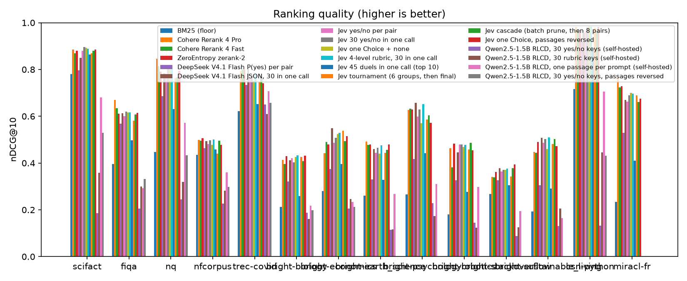

<!-- case:en -->

[Project](https://github.com/anessbelbati/jev-rerank-bench)

Compares Jev relevance rubrics with other rerankers on shared BM25 candidates and publishes saved responses and scoring code.

**Scope:** The headline averages do not establish a winner; weighting datasets versus queries changes the comparison.

Original author material: Author retrieval evaluation chart. Measurements shown are author-reported, not SeeAPI tests. MIT · [Source](https://github.com/anessbelbati/jev-rerank-bench/blob/cd9a35b22aeb4187334f7018a0ee1960a7470586/results/quality.png) · [License and attribution](../../THIRD_PARTY_NOTICES.md)

<!-- case:zh -->

[项目来源](https://github.com/anessbelbati/jev-rerank-bench)

基于相同 BM25 候选，对比 Jev 相关性评分与其他重排模型，公开保存的响应和评分代码。

**边界:** 汇总均值不足以确定胜者；按数据集或按查询加权会改变比较结果。

原作者素材：作者检索评测图表；图中数据为作者记录，并非 SeeAPI 实测。 MIT · [来源](https://github.com/anessbelbati/jev-rerank-bench/blob/cd9a35b22aeb4187334f7018a0ee1960a7470586/results/quality.png) · [许可与署名](../../THIRD_PARTY_NOTICES.md)

