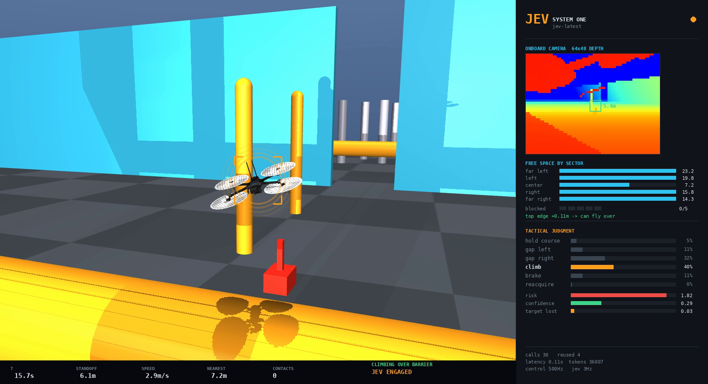

<!-- case:en -->

[Project](https://github.com/RomanSlack/jev-drone) · [Discovery post](https://x.com/yibie/status/2100619188062523695)

A MuJoCo quadrotor simulation converts camera depth and segmentation into symbolic scene data; Jev advises maneuvers and risk while conventional code handles flight control and safety.

**Pattern:** Perception in code → tactical judgment → guarded control.

**Scope:** Simulation rather than real-world flight; Jev receives JSON rather than images and is advisory. The author reports one successful course run with substantial run-to-run variance.

Original material: the jev-drone authors · MIT · Unmodified · [Source](https://github.com/RomanSlack/jev-drone/blob/cbeb53ce4f17a06ea490ae43effcdad231143610/docs/climb.png) · [License and attribution](../../THIRD_PARTY_NOTICES.md)

<!-- case:zh -->

- **场景与做法**：MuJoCo 四旋翼模拟器将相机深度与分割结果转换为场景数据，由 Jev 建议机动动作和风险，普通代码负责飞控与安全。
- **可借鉴点**：代码感知 → 战术判断 → 受约束的控制。
- **边界**：模拟飞行而非真实无人机飞行；Jev 接收 JSON 而非图像，仅提供建议。作者报告单次成功路线，同时明确运行结果存在较大波动。
- **来源**：[项目](https://github.com/RomanSlack/jev-drone) · [发现来源帖子](https://x.com/yibie/status/2100619188062523695)。

原作者素材：the jev-drone authors · MIT · 未修改 · [来源](https://github.com/RomanSlack/jev-drone/blob/cbeb53ce4f17a06ea490ae43effcdad231143610/docs/climb.png) · [许可与署名](../../THIRD_PARTY_NOTICES.md)

